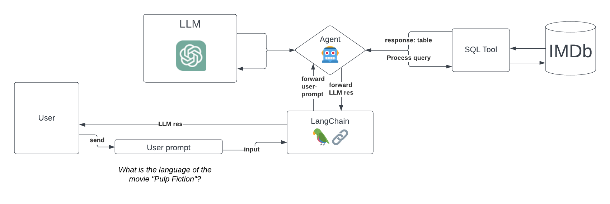

# BI Assistant 

## 🦜🔗 LangChain SQL BI Assistant for IMDB
An LLM-based application that communicates with a DB to extract information.

The application takes a user input (question related to or inquiry about the DB) in natural language --> convert to SQL query --> query the DB --> return result to LLM --> final output to user

# IMPORTANT:
To view this Streamlit app on a browser, run it with the following command:

    streamlit run PATH\main.py [ARGUMENTS]

# Part I - Proposed Solution
## Description of High-Level Architecture
### Frameworks: LangChain alongside OpenAI's GPT (NLP) + Streamlit (front-end)
**LangChain 🦜🔗 (a framework to develop applications on LLMs):**
* Actively developing SQL agent ability
* Seamless connection with OpenAI
* Open-source
* Under constant development
* Well-documented
* Extensive usage
* Extensive community support
* Reliable
* Text-to-SQL query VS Text-to-SQL query and execution VS SQL Agent
			
:
* Open-source
* Great documentation
* Community support
* Customization
* Pure Python
* Seamless integrations
* Deployment
* LLM and ML support
			
:
* A good alternative that shares most of Streamlit's pros.
* A suitable a good substitute.
* I personally like Streamlit, and since it was recently acquired by SnowFlake, believe in its potential to grow much faster. Yet, both are great options.
			
### Models & Algorithms
* Used: model='gpt-3.5-turbo-1106'
			
:
* Seamless connection with LangChain
* Best performing model in the market
* Regularly updated offering continuous improvements
* Hallucinations
			
**Alternatives: Open-source LLMs 🦙 (pros & cons):**
* A plethora of fine-tuned open-source models for sql-generation
* Much more cost-effective
* Docker
* Hallucinations
* Incorporate a combined approach of using an open-source LLM that was fine-tuned for SQL **generation** alongside LangChain's SQL query **execution**.
* This is a valid choice, yet it means waiving the main advantages of the SQL Agent.
  Namely, recovering from errors + answering questions based on the databases’ schema as well as on the databases’ content.  
 
### Database: 
* Open-source and free
* Good support and documentation
* Reliable
* Supports a wide range of extensions
* Seamlessly integrates with Python

## Preprocessing Stages - Description & Considerations
### Files
* Download the non-commercial IMDB dataset from [IMDB datasets](https://datasets.imdbws.com/)
* See [IMDB Non-commercial datasets](https://developer.imdb.com/non-commercial-datasets/) for file description
* Unzip files (`tsv.gz` files)
* Preprocess files before uploading to the Database
  * Handling null values correctly
  * Handling mixed data types in the same column				  
  
### Database
* Choose an appropriate SQL Engine
* Set-up a new database
* Create tables and columns that correspond to the TSV files
* Column data types: When deciding on dtypes take into account performance and storage issues and considerations:
  * `str` - check `df['col'].str.len().max()` to decide on `n` for `VARCHAR(n)`
  * `int` - `INTEGER` vs `SMALLINT`
    *   `SMALLINT` relevant for: `title.basics.tsv` (`startYear` and `endYear` columns) and
      `name.basics.tsv` (`birthYear` and `deathYear` columns)
  * `float` - `DOUBLE PRECISION`
  * `bool` - `BOOLEAN`
  * `List[str]` - `VARCHAR(n)[]` unless behaves like `VARCHAR(n)`
    * Relevant for:
      `title.akas.tsv` (`types` and `attribuites` columns)
      and `title.basics.tsv` (`genres` column)

* Import the preprocessed TSV files into the newly created tables
  * Exceptionally large files should be broken into smaller files and uploaded sequentially in batches.
  * Write errors to file and inspect `error_file.txt` to further handle any problematic records.
  * Insert inconvertible values as null (mark the tick-box in the 'Data Import' dialogue box)

### Libraries
* **Problem:** LangChain-OpenAI incompatibility issues due to OpenAI's `ChatCompletion` endpoint change not yet integrated in LangChain.
  * **Solution:** Downgrade to `openai==0.28` (versions 1.0.0+ will not work until LangChain is updated accordingly).
* **Issue:** LangChain `return_intermediate_steps` param isn't yet applicable for LangChain SQL Agents.
  * **Solution:** Consider using a Text-to-SQL query (and Execution) instead to access intermediate steps.
  * **Considerations:** LangChain's SQL Agent provides a more flexible and advanced way of interacting with SQL Databases (see Part I above - Frameworks) 
* OpenAI `temperature` param - set to value of `0` to block model creativeness when translating free text client Qs to SQL queries.
		
## Description of the Entire Question-Answering Flow
User prompt > LangChain employs a SQL Agent to handle the back-and-forth deliberations between the LLM and the DB (using the SQL tool by proxy) that queries and returns responses from the DB > Until the LLM is satisfied with the result > Return response to client

## Future improvements:
* Set primary and foreign keys (Database)
* Improve prompt to LLM with few-show examples of natural language requests and corresponding SQL queries (LangChain)
* Improve LLM retrieval with vectorBD storage and similarity comparison to other relevant SQL queries.
* Export the DB to a compressed file
  * Bash command - `pg_dump -U [username] -h [hostname] -d [databasename] | gzip > [full_path_of_output_file.sql.gz]`
* Docker
* Set params in `secret.py` to environment variables
* Integrate a chatbot to interact with the user, accept secret params and set them accordingly in the virtual environment to establish a live connection to the database.

[Add example_queries.pdf](docs/example_queries.pdf)
